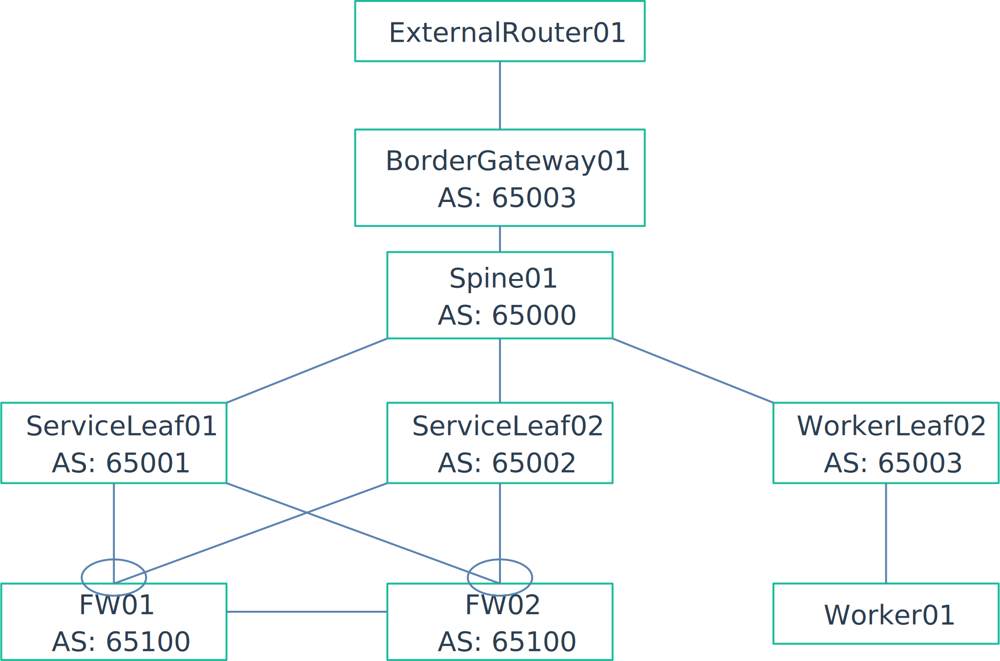

This is an example on on how to implement a basic active passive firewall firewall cluster using EVPN VXLAN to route between VRFs. The firewalls are connected to the fabric using BGP.t 

# Running the lab
This lab is based on containerlab, however the SONiC configurations may be used in any other simulation tool.
The environment is based on the VM version of SONiC. A tutorial on how to get the latest SONiC VM running in containerlsb can be found [here][https://containerlab.dev/manual/kinds/sonic-vm/] The firewall containers have to be build.

```bash 
# run the following in ./docker/firewall
docker build -t firewall .
```

Once the container finishes building the lab can be started. To deploy the configurations 


```bash 
ansible-playbook -i clab-FirewallInsertion/ansible-inventory.yml ansible/deploy.yml
```
Afterwards the lab should be fully functional. To confirm connect to the clab-FirewallInsertion-worker01 node and ping 10.100.0.1 which is located on the external router.

The traffic will first be routed to the firewalls using the Vrf_CustPriv01 where it will be source natted into the public vrf.

# Topology



The topology in this lab is a scaled down spine leaf setup. There is only one spine and one worker leaf to make the lab a little easier to run. 
